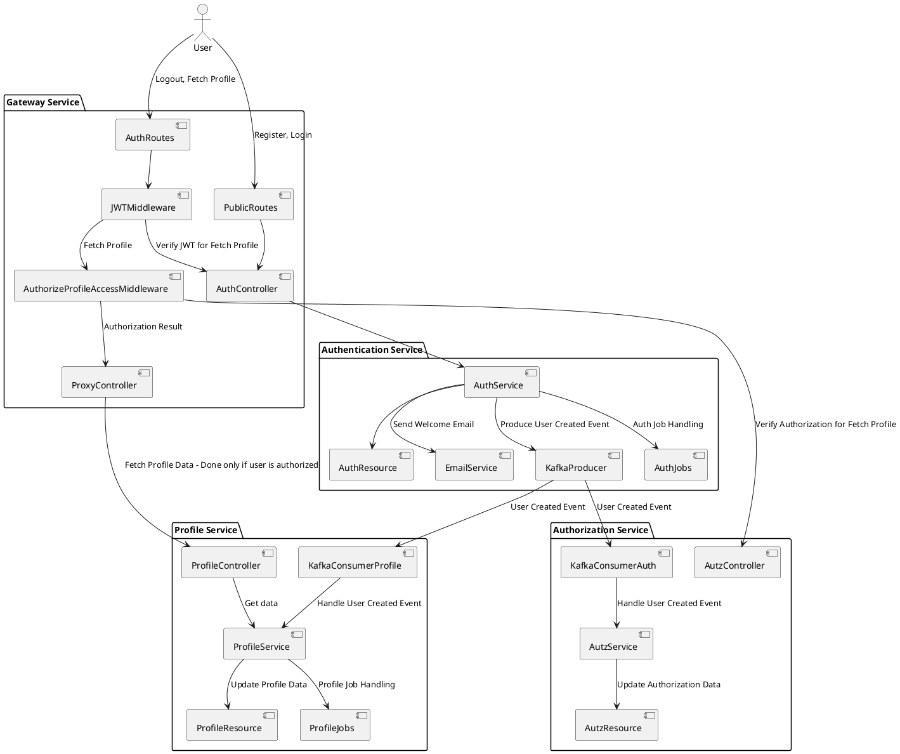

# Microservices-Based Application Documentation

## Global - packages

```plantuml
@startuml
allowmixing

actor User

package "Gateway Service" {
  component JWTMiddleware
  component AuthorizeProfileAccessMiddleware
  component ProxyController
  component AuthController
  component AuthRoutes
  component PublicRoutes
}

package "Authentication Service" {
  component AuthController
  component AuthService
  component AuthResource
  component EmailService
  component KafkaProducer
  component AuthJobs
}

package "Authorization Service" {
  component AutzController
  component AutzService
  component AutzResource
  component KafkaConsumerAuth
}

package "Profile Service" {
  component ProfileController
  component ProfileService
  component ProfileResource
  component KafkaConsumerProfile
  component ProfileJobs
}

User --> PublicRoutes: Register, Login
PublicRoutes --> AuthController

User --> AuthRoutes: Logout, Fetch Profile
AuthRoutes --> JWTMiddleware

JWTMiddleware --> AuthController : Verify JWT for Fetch Profile
JWTMiddleware --> AuthorizeProfileAccessMiddleware : Fetch Profile

AuthorizeProfileAccessMiddleware --> AutzController : Verify Authorization for Fetch Profile
AuthorizeProfileAccessMiddleware --> ProxyController : Authorization Result

ProxyController --> ProfileController : Fetch Profile Data - Done only if user is authorized
ProfileController --> ProfileService : Get data

AuthController --> AuthService
AuthService --> AuthResource
AuthService --> EmailService : Send Welcome Email
AuthService --> KafkaProducer : Produce User Created Event

KafkaProducer --> KafkaConsumerAuth : User Created Event
KafkaConsumerAuth --> AutzService : Handle User Created Event
AutzService --> AutzResource : Update Authorization Data

KafkaProducer --> KafkaConsumerProfile : User Created Event
KafkaConsumerProfile --> ProfileService : Handle User Created Event
ProfileService --> ProfileResource : Update Profile Data

AuthService --> AuthJobs : Auth Job Handling
ProfileService --> ProfileJobs : Profile Job Handling

@enduml
```