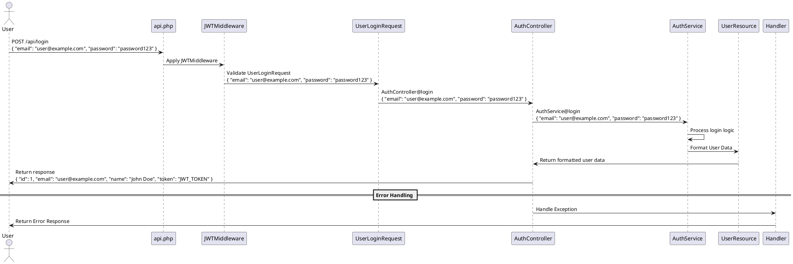

# Microservices-Based Application Documentation

## Login

```plantuml
@startuml
actor User
participant "api.php" as Route
participant "JWTMiddleware" as Middleware
participant "UserLoginRequest" as RequestValidator
participant "AuthController" as Controller
participant "AuthService" as Service
participant "UserResource" as Resource
participant "Handler" as ErrorHandling

User -> Route: POST /api/login\n{ "email": "user@example.com", "password": "password123" }
Route -> Middleware: Apply JWTMiddleware
Middleware -> RequestValidator: Validate UserLoginRequest\n{ "email": "user@example.com", "password": "password123" }
RequestValidator -> Controller: AuthController@login\n{ "email": "user@example.com", "password": "password123" }
Controller -> Service: AuthService@login\n{ "email": "user@example.com", "password": "password123" }
Service -> Service: Process login logic
Service -> Resource: Format User Data
Resource -> Controller: Return formatted user data
Controller -> User: Return response\n{ "id": 1, "email": "user@example.com", "name": "John Doe", "token": "JWT_TOKEN" }

== Error Handling ==
Controller -> ErrorHandling: Handle Exception
ErrorHandling -> User: Return Error Response

@enduml
```