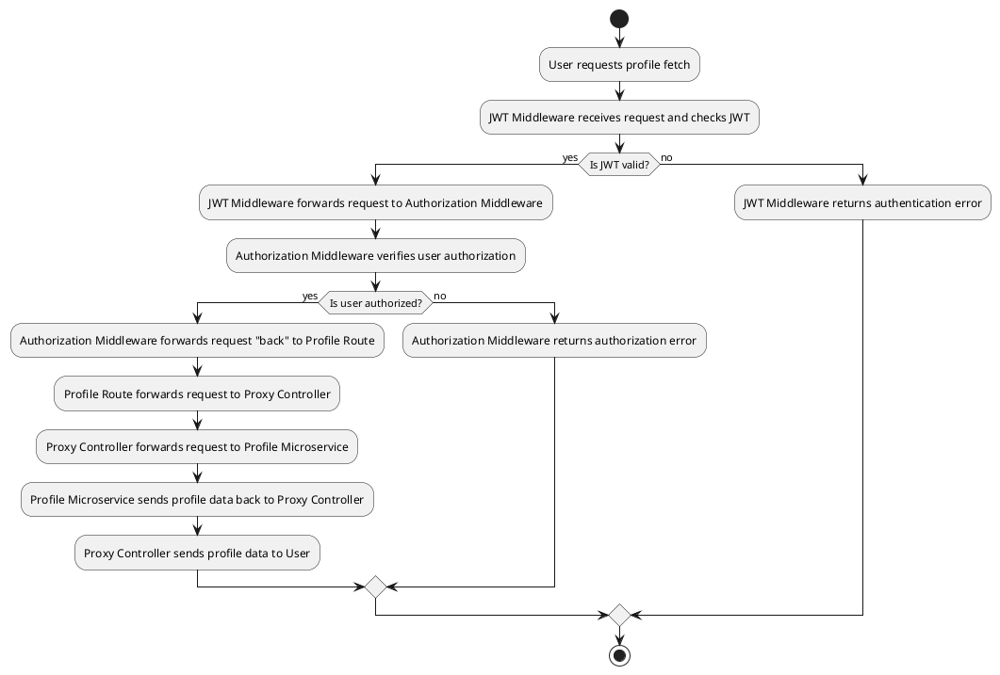

# Microservices-Based Application Documentation

## Profile Activity

```plantuml
@startuml
start
:User requests profile fetch;
:JWT Middleware receives request and checks JWT;
if (Is JWT valid?) then (yes)
    :JWT Middleware forwards request to Authorization Middleware;
    :Authorization Middleware verifies user authorization;
    if (Is user authorized?) then (yes)
        :Authorization Middleware forwards request "back" to Profile Route;
        :Profile Route forwards request to Proxy Controller;
        :Proxy Controller forwards request to Profile Microservice;
        :Profile Microservice sends profile data back to Proxy Controller;
        :Proxy Controller sends profile data to User;
    else (no)
        :Authorization Middleware returns authorization error;
    endif
else (no)
    :JWT Middleware returns authentication error;
endif
stop
@enduml
```