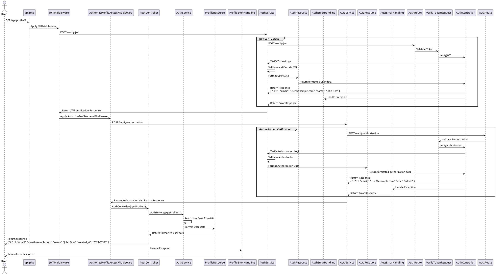

# Microservices-Based Application Documentation

## Profile

```plantuml
@startuml

actor User
participant "api.php" as Route
participant "JWTMiddleware" as AuthMiddleware
participant "AuthorizeProfileAccessMiddleware" as ProfileMiddleware
participant "AuthController" as ProfileController
participant "AuthService" as ProfileService
participant "ProfileResource" as ProfileResource
participant "ProfileErrorHandling" as ProfileErrorHandling

participant "AuthService" as AuthService
participant "AuthResource" as AuthResource
participant "AuthErrorHandling" as AuthErrorHandling

participant "AutzService" as AutzService
participant "AutzResource" as AutzResource
participant "AutzErrorHandling" as AutzErrorHandling

User -> Route: GET /api/profile/1
Route -> AuthMiddleware: Apply JWTMiddleware
AuthMiddleware -> AuthService: POST /verify-jwt
group JWT Verification
    AuthService -> AuthRoute: POST /verify-jwt
    AuthRoute -> VerifyTokenRequest: Validate Token
    VerifyTokenRequest -> AuthController: verifyJWT
    AuthController -> AuthService: Verify Token Logic
    AuthService -> AuthService: Validate and Decode JWT
    AuthService -> AuthResource: Format User Data
    AuthResource -> AuthController: Return formatted user data
    AuthController -> AuthService: Return Response\n{ "id": 1, "email": "user@example.com", "name": "John Doe" }
    AuthController -> AuthErrorHandling: Handle Exception
    AuthErrorHandling -> AuthService: Return Error Response
end
AuthService -> AuthMiddleware: Return JWT Verification Response
AuthMiddleware -> ProfileMiddleware: Apply AuthorizeProfileAccessMiddleware
ProfileMiddleware -> AutzService: POST /verify-authorization
group Authorization Verification
    AutzService -> AutzRoute: POST /verify-authorization
    AutzRoute -> VerifyTokenRequest: Validate Authorization
    VerifyTokenRequest -> AuthController: verifyAuthorization
    AuthController -> AuthService: Verify Authorization Logic
    AuthService -> AuthService: Validate Authorization
    AuthService -> AutzResource: Format Authorization Data
    AutzResource -> AuthController: Return formatted authorization data
    AuthController -> AutzService: Return Response\n{ "id": 1, "email": "user@example.com", "role": "admin" }
    AuthController -> AutzErrorHandling: Handle Exception
    AutzErrorHandling -> AutzService: Return Error Response
end
AutzService -> ProfileMiddleware: Return Authorization Verification Response
ProfileMiddleware -> ProfileController: AuthController@getProfile(1)
ProfileController -> ProfileService: AuthService@getProfile(1)
ProfileService -> ProfileService: Fetch User Data from DB
ProfileService -> ProfileResource: Format User Data
ProfileResource -> ProfileController: Return formatted user data
ProfileController -> User: Return response\n{ "id": 1, "email": "user@example.com", "name": "John Doe", "created_at": "2024-07-03" }

ProfileController -> ProfileErrorHandling: Handle Exception
ProfileErrorHandling -> User: Return Error Response

@enduml
```