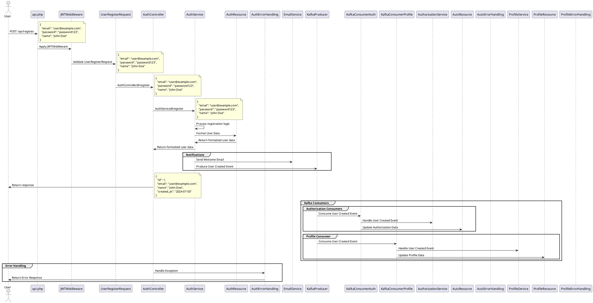

# Microservices-Based Application Documentation

## Register

```plantuml
@startuml

actor User
participant "api.php" as Route
participant "JWTMiddleware" as AuthMiddleware
participant "UserRegisterRequest" as RequestValidator
participant "AuthController" as AuthController
participant "AuthService" as AuthService
participant "AuthResource" as AuthResource
participant "AuthErrorHandling" as AuthErrorHandling
participant "EmailService" as EmailService
participant "KafkaProducer" as KafkaProducer
participant "KafkaConsumerAuth" as KafkaConsumerAuth
participant "KafkaConsumerProfile" as KafkaConsumerProfile

participant "AuthorizationService" as AutzService
participant "AutzResource" as AutzResource
participant "AutzErrorHandling" as AutzErrorHandling

participant "ProfileService" as ProfileService
participant "ProfileResource" as ProfileResource
participant "ProfileErrorHandling" as ProfileErrorHandling

User -> Route: POST /api/register
note right
{
  "email": "user@example.com", 
  "password": "password123", 
  "name": "John Doe"
}
end note
Route -> AuthMiddleware: Apply JWTMiddleware
AuthMiddleware -> RequestValidator: Validate UserRegisterRequest
note right
{
  "email": "user@example.com", 
  "password": "password123", 
  "name": "John Doe"
}
end note
RequestValidator -> AuthController: AuthController@register
note right
{
  "email": "user@example.com", 
  "password": "password123", 
  "name": "John Doe"
}
end note
AuthController -> AuthService: AuthService@register
note right
{
  "email": "user@example.com", 
  "password": "password123", 
  "name": "John Doe"
}
end note
AuthService -> AuthService: Process registration logic
AuthService -> AuthResource: Format User Data
AuthResource -> AuthService: Return formatted user data
AuthService -> AuthController: Return formatted user data

group Notifications
    AuthService -> EmailService: Send Welcome Email
    AuthService -> KafkaProducer: Produce User Created Event
end

AuthController -> User: Return response
note right
{
  "id": 1, 
  "email": "user@example.com", 
  "name": "John Doe", 
  "created_at": "2024-07-03"
}
end note

group Kafka Consumers
    group Authorization Consumers
    KafkaProducer -> KafkaConsumerAuth: Consume User Created Event
    KafkaConsumerAuth -> AutzService: Handle User Created Event
    KafkaConsumerAuth -> AutzResource: Update Authorization Data
    end
    group Profile Consumer
    KafkaProducer -> KafkaConsumerProfile: Consume User Created Event
    KafkaConsumerProfile -> ProfileService: Handle User Created Event
    KafkaConsumerProfile -> ProfileResource: Update Profile Data
    end
end

group Error Handling
    AuthController -> AuthErrorHandling: Handle Exception
    AuthErrorHandling -> User: Return Error Response
end

@enduml
```