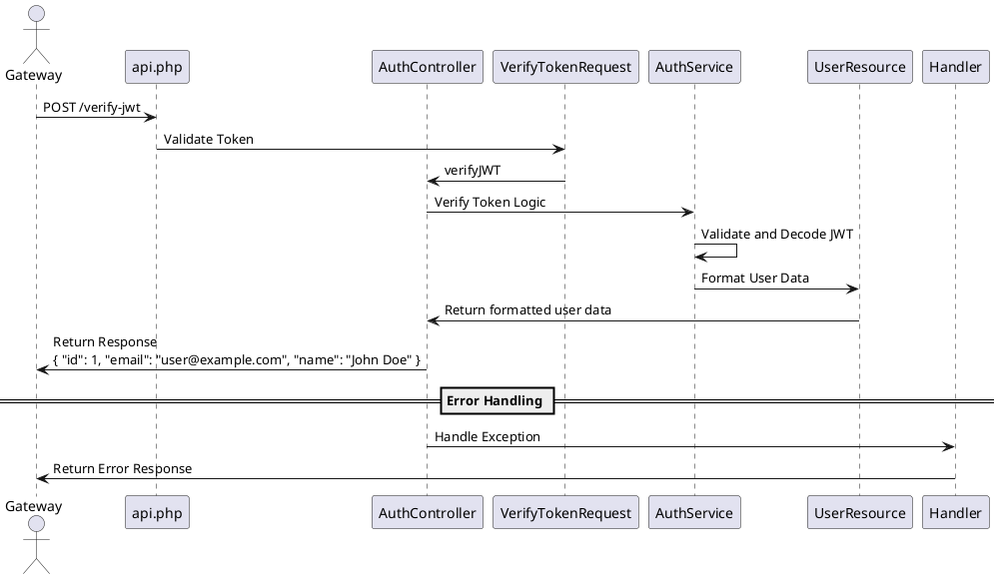

# Microservices-Based Application Documentation

## Verify JWT

```plantuml
@startuml

actor Gateway
participant "api.php" as AuthRoute
participant "AuthController" as AuthController
participant "VerifyTokenRequest" as VerifyTokenRequest
participant "AuthService" as AuthService
participant "UserResource" as UserResource
participant "Handler" as ErrorHandling

Gateway -> AuthRoute: POST /verify-jwt
AuthRoute -> VerifyTokenRequest: Validate Token
VerifyTokenRequest -> AuthController: verifyJWT
AuthController -> AuthService: Verify Token Logic
AuthService -> AuthService: Validate and Decode JWT
AuthService -> UserResource: Format User Data
UserResource -> AuthController: Return formatted user data
AuthController -> Gateway: Return Response\n{ "id": 1, "email": "user@example.com", "name": "John Doe" }

== Error Handling ==
AuthController -> ErrorHandling: Handle Exception
ErrorHandling -> Gateway: Return Error Response

@enduml
```